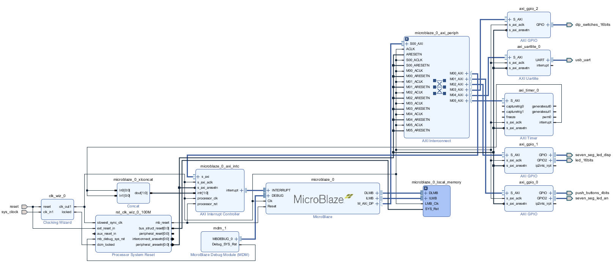

# [Microélectronique] Compte rendu - TP 
**Auteurs :** Simon REMY et Geoffroy LOISELET

---

## Partie I : Animation d'un message lumineux

### Réalisation d'un système numérique MicroBlaze

Dans cette partie, nous avons suivi les instructions de l'énoncé pour créer la platforme nous permettant de développer sur la carte **xc7a35tcpg236-1**. 

Avant de faire cela, nous avons suivi le tutoriel sur MicroBlaze sur Moodle qui nous a permis d'apprendre à configurer le hardware pour pouvoir développer par la suite dessus. 

Grâce à cela, nous avons réalisé la configuration suivante : 

[]: # (Mettre une image de la config MicroBlaze)

Avec cette configuration, nous sommes désormais en mesure de développer sur le processeur de la carte et ainsi contrôler les périphérique de la carte, notamment avec les deux fonctions : `Test_leds` et `sw2leds`.

Avant de contrôler les LEDs, il est nécessaire de les initialiser. Pour cela, nous déclarons une variable de type `XGpio`, qui sert d'interface logicielle vers les périphériques GPIO de la carte. Nous l'initialisation de cette façon :

```c
XGpio_Initialize(&leds, XPAR_AXI_GPIO_1_DEVICE_ID);
```

> `XPAR_AXI_GPIO_1_DEVICE_ID` est un identifiant défini dans `xparameters.h`, associé au bloc GPIO relié aux LEDs dans le design Vivado.

On configure ensuite ce GPIO en sortie à l'aide de :
```c
XGpio_SetDataDirection(&leds, 2, 0x0000);
```

`XGpio_SetDataDirection(instance, canal, masque)` définit la direction de chaque broche du GPIO. Un bit à `0` correspond à une sortie, un bit à `1` à une entrée. Ici, `0x0000` configure l'intégralité des broches du canal 2 en sortie.

On peut désormais contrôler les LEDs avec `Test_leds` : 

``` C
void Test_leds(XGpio * leds) {
	static int val = 0xAAAA;
	XGpio_DiscreteWrite(leds, 2, val);
	usleep(50000);
	val = ~val;
}
```

Cette fonction permet de faire clignoter les LEDs. En écrivant `0xAAAA` sur le GPIO, nous venons allumer une LED sur deux. Puis, nous attendons 50ms avant d'inverser la valeur écrite sur chaque LED, inversant ainsi leur état. 

Maintenant que les LEDs fonctionnent, nous pouvons élargir le programme pour contrôler ces dernières avec les interrupteurs de la carte : 

``` C
void sw2leds(XGpio * switchs, XGpio * leds){
	u32 etat = XGpio_DiscreteRead(switchs, 1);
	XGpio_DiscreteWrite(leds, 2, etat);
}
```

Dans cette fonction, nous récupèrons l'état des interrupteurs (position haute ou basse / ouvert ou femré) et nous l'écrivons sur les LEDs. Ce qui fait que chaque LED est contrôlée par un interrupteur et son état définit l'état de la LED.

### Contrôle des 7 segments par le MicroBlaze

Dans cette partie, on continue de travailler avec les périphériques de la carte en faisant fonctionner ses 4 afficheurs 7 segments :

Chaque afficheur est composé de 7 LEDs indépendantes, organisées en segments nommés de `A` à `G`. Ces afficheurs fonctionnent en anodes communes : cela signifie qu'écrire un `0` sur un segment l'allume, et un `1` l'éteint (logique inversée). En appliquant ce principe, on peut déterminer la valeur binaire à écrire sur le GPIO pour afficher chaque chiffre ou lettre :

``` C
#define seg0 0xC0
#define seg1 0xF9
#define seg2 0xA4
#define seg3 0xB0
#define seg4 0x99
#define seg5 0x92
#define seg6 0x82
#define seg7 0xF8
#define seg8 0x80
#define seg9 0x90
#define segA 0x88
#define segB 0x83
#define segC 0xC6
#define segD 0xA1
#define segE 0x86
#define segF 0x8E
```

On peut ainsi afficher les 16 valeurs hexadécimales, de `0` à `F`.

Les 4 afficheurs partagent les mêmes broches de segments. Il n'est donc pas possible de leur envoyer des valeurs différentes simultanément. Pour régler ce problème, on utilise le principe de persistance rétinienne : on active chaque afficheur l'un après l'autre en boucle, suffisamment rapidement pour que l'œil perçoive les 4 afficheurs comme allumés en même temps.

Afin de définir la valeur à afficher sur chacun des 4 afficheurs, on utilise les 16 interrupteurs de la carte. Chaque groupe de 4 interrupteurs encode en binaire la valeur d'un afficheur :

- 4 interrupteurs → 4 bits de données → 16 combinaisons possibles → valeurs de `0` à `F`

Ainsi, les interrupteurs 0 à 3 contrôlent le premier afficheur, les interrupteurs 4 à 7 le deuxième, et ainsi de suite.

Nous avons donc écrit cette fonction permettant d'afficher la valeur sélectionnée par les interrupteurs :

```C
int bin2hex[] = {seg0, seg1, seg2, seg3, seg4, seg5, seg6, seg7,
				 seg8, seg9, segA, segB, segC, segD, segE, segF};

void sw2seg(XGpio * switchs, XGpio * segments_an, XGpio * segments_disp) {

	u32 etat = XGpio_DiscreteRead(switchs, 1);

	XGpio_DiscreteWrite(segments_an, 2, 0xFFFE);
	XGpio_DiscreteWrite(segments_disp, 1, (bin2hex[etat & 0x000F]));
	usleep(2000);

	XGpio_DiscreteWrite(segments_an, 2, 0xFFFD);
	XGpio_DiscreteWrite(segments_disp, 1, (bin2hex[(etat & 0x00F0) >> 4]));
	usleep(2000);

	XGpio_DiscreteWrite(segments_an, 2, 0xFFFB);
	XGpio_DiscreteWrite(segments_disp, 1, (bin2hex[(etat & 0x0F00) >> 8]));
	usleep(2000);

	XGpio_DiscreteWrite(segments_an, 2, 0xFFF7);
	XGpio_DiscreteWrite(segments_disp, 1,  (bin2hex[(etat & 0xF000) >> 12]));
	usleep(2000);
}
```

Dans ce programme, avant de rentrer dans la fonction, nous commençons par construire un tableau possédant toutes les valeurs que nous voulons afficher et dans l'ordre. Nous entrons ensuite dans la fonction qui va tourner en boucle. Dans un premier temps, nous lisons la valeur sur les interrupteurs. Ensuite, nous allons afficher cette valeur sur l'afficheur 7 segments correspondant.

Les afficheurs 7 segments que nous avons, sont paramétrés par un coté anode et un coté anode. Le coté anode permet de sélectionner sur quel afficheur nous travaillons. Grâce à la documentation, nous avons trouvé comment sélectionner les afficheurs séparement, `0xFFFE` pour le premier (celui le plus à droite), `0xFFFD` pour le milieu droit, `0xFFFB` pour le milieu gauche et `0xFFF7` pour le plus à droite. Nous pouvons donc maintenant sélectionner sur quel 7 segments nous souhaitons afficher grâce à la ligne `XGpio_DiscreteWrite(segments_an, 2, X);` avec `segments_an` pour bien travailler avec l'anode, le `2` puisque nous utilisons le channel 2 du GPIO,et X l'un des 4 codes hexadécimal écrits juste avant.

Maintenant que nous avons choisi le 7 segment que nous souhaitons, nous pouvons choisir quel segment afficher grâce à la cathode : `XGpio_DiscreteWrite(segments_disp, 1, (bin2hex[(etat & 0x0000F000) >> 12]));`. La variable `segments_disp` permet de travailler sur les cathodes, le `1` pour le channel 1. Le `bin2hex[(etat & 0x0F000) >> 12])` permet de selectionner la valeur hexadécimale correspondant à la position des interrupteurs correspondants. Pour ce faire, nous devons donc utiliser un masque pour bien choisir les bits correspondants aux interrupteurs et à l'afficheur sélectionné.

Avant de passer au prochain 7 segments, nous appliquons un délai afin que l'affichage de soit pas trop rapide, mais ni trop lent. C'est grâce à ce délai que la persistence rétinienne fonctionne. Nous pouvons ensuite passer à l'afficheur suivant, et cela en boucle.


### Animation du message "HELLO 2026"

Dans la lancée du programme précédent, on cherche maintenant à réaliser une animation avec les afficheurs 7 segments pour faire déffiler le message "HELLO 2026" dans un sens comme dans l'autre. La fonction sera très similaire à celle précédente :

```C
#define segH 0x89
#define segL 0xC7

int bin2hex_hello[] = {0xFF, 0xFF, 0xFF, segH, segE, segL, segL, seg0, 0xFF, seg2, seg0, seg2, seg6, 0xFF};

void Hello(XGpio * segments_an, XGpio * segments_disp, int position){

	XGpio_DiscreteWrite(segments_an, 2, 0xFFFE);
	XGpio_DiscreteWrite(segments_disp, 1, (bin2hex_hello[(position+3)%14]));
	usleep(2000);

	XGpio_DiscreteWrite(segments_an, 2, 0xFFFD);
	XGpio_DiscreteWrite(segments_disp, 1, (bin2hex_hello[(position+2)%14]));
	usleep(2000);

	XGpio_DiscreteWrite(segments_an, 2, 0xFFFB);
	XGpio_DiscreteWrite(segments_disp, 1, (bin2hex_hello[(position+1)%14]));
	usleep(2000);

	XGpio_DiscreteWrite(segments_an, 2, 0xFFF7);
	XGpio_DiscreteWrite(segments_disp, 1,  (bin2hex_hello[(position+0)%14]));
	usleep(2000);
}
```
Et dans le main pour l'appel de la fonction, nous devons écrire ceci : 

```C
int position = 0;
int cpt = 0;
int seuil = 20;

while(1) {
    	Hello(&segments_an, &segments_disp, position);

    	if (cpt >= seuil) {
    		cpt = 0;
			position = (position + 1)%14;
    	}
    	cpt++;
    }
```

De même que pour l'affichage des valeurs sur les interrupteurs, nous devons créer un tableau contenant les valeurs hexadécimale des caractère que nous souhaitons écrire, et ce dans l'ordre. Nous avons ajouté deux caractères, `H` et `L` (nous prendrons `0` pour faire le `O`). Encore une fois, nous choisissons dans un premier temps l'afficheur 7 segments sur lequel nous souhaitons afficher comme ce que nous avons fait précédement. Le changement principal se fait dans la sélection des cathodes.

En effet, nous souhaitons afficher le message en le faisant défiler de gauche à droite dans un premier temps. Si nous nous plaçons dans la première itération, nous devons donc afficher `H` sur l'afficheur de droite, et rien sur les autres. C'est pour cette raison que nous avons mis 3 `0xFF` au début de notre liste `bin2hex_hello`. Pour l'affichage, nous devons donc sélectionner les caractères mais avec un décalage pour chaque afficheur afin que les caractère se suivent.

Pour faire cet effet, il faut incrémenter la valeur de la position dès que nous avons avons fait un certain nombre d'itération définit par la variable seuil (ici nous avons pris 20). C'est cette variable qui permet de gérer la vitesse de notre défillement. Nous avons 14 caractères différents, ce qui correspond donc à 14 positions différentes pour notre affichage.

Si nous voulons changer le sens de notre défillement, nous devons simplement changer les lignes :
 ```C
 `position + 3` en `position + 0`
 `position + 2` en `position + 1`
 `position + 1` en `position + 2`
 `position + 0` en `position + 3`
```

## Partie II : Amélioration du système

### Utilisation du Timer pour rythmer le défilement

Jusqu'ici, la gestion du temps entre deux trames de l'animation reposait sur des appels à `usleep`, mobilisant continuellement le processeur. Afin de réduire cette charge, on ajoute un timer matériel qui prend en charge cette tâche de façon autonome, libérant ainsi le processeur pour d'autres traitements.

Pour cela, on a modifié la configuration du système afin d'y intégrer un bloc timer :



A partir du code code fourni sur Moodle, on est en mesure de piloter le timer généré par Vivado. La principale modification apportée concerne la ligne de configuration des options :
```c
XTmrCtr_SetOptions(&TimerInst, TIMER_CNTR,
    XTC_INT_MODE_OPTION | XTC_AUTO_RELOAD_OPTION | XTC_DOWN_COUNT_OPTION);
```

Les trois flags utilisés ont les rôles suivants :

- `XTC_INT_MODE_OPTION` : active la génération d'interruptions par le timer.
- `XTC_AUTO_RELOAD_OPTION` : recharge automatiquement la valeur de reset lorsque le compteur atteint zéro, assurant un fonctionnement périodique.
- `XTC_DOWN_COUNT_OPTION` : configure le timer en décrémentation plutôt qu'en incrémentation.

La valeur de reset est fixée à `100 000 000 / 8`, ce qui génère
8 interruptions par seconde, soit une mise à jour de l'animation 8 fois par seconde.

La logique de progression de l'animation, auparavant gérée dans la boucle principale via les variables `cpt` et `seuil`, est désormais déplacée dans le gestionnaire d'interruption `Timer_ISR_Handler` :
```c
position = (position + 1) % 14;
```

À chaque interruption du timer, cette ligne incrémente la position courante dans le tableau des caractères, en bouclant sur 14 valeurs. La boucle `while` principale est ainsi allégée, et la cadence de l'animation est entièrement pilotée par le timer.

### Contrôle de la vitesse et du sens de défilement

Pour gérer le sens de défilement on lit la valeur du bit de poids faible issu de la lecture des interrupteurs :

```c
u32 etat = XGpio_DiscreteRead(&switchs, 1);
sens = etat & 0x0001;
```

Cette valeur est ensuite transmise à la fonction `Hello`, qui gère l'affichage de l'animation :

```c
void Hello(XGpio *segments_an, XGpio *segments_disp, int position, int sens) {
    XGpio_DiscreteWrite(segments_an, 2, 0xFFFE);
    XGpio_DiscreteWrite(segments_disp, 1, bin2hex[(position + 3 * sens) % 14]);
    usleep(2000);
    XGpio_DiscreteWrite(segments_an, 2, 0xFFFD);
    XGpio_DiscreteWrite(segments_disp, 1, bin2hex[(position + 2 * sens + 1 * (!sens)) % 14]);
    usleep(2000);
    XGpio_DiscreteWrite(segments_an, 2, 0xFFFB);
    XGpio_DiscreteWrite(segments_disp, 1, bin2hex[(position + 1 * sens + 2 * (!sens)) % 14]);
    usleep(2000);
    XGpio_DiscreteWrite(segments_an, 2, 0xFFF7);
    XGpio_DiscreteWrite(segments_disp, 1, bin2hex[(position + 3 * (!sens)) % 14]);
    usleep(2000);
}
```

Le sens de défilement est géré en modifiant l'ordre dans lequel les caractères
du tableau `bin2hex` sont lus :

- Gauche → droite (`sens = 1`) : les caractères sont lus dans l'ordre croissant des indices du tableau.
- Droite → gauche (`sens = 0`) : les caractères sont lus dans l'ordre décroissant des indices du tableau.

La variable `sens` agit donc directement sur les indices du tableau afin d'inverser cet ordre sans utiliser de `if`.


La vitesse de défilement est contrôlée via la valeur de reset du timer, modifiée à l'aide de `XTmrCtr_SetResetValue`. En ajustant cette valeur, on change le temps que met le timer pour atteindre zéro, et donc la fréquence à laquelle les interruptions sont déclenchées — ce qui détermine la cadence de mise à jour de l'affichage.

Cette valeur est calculée à partir de 4 interrupteurs dédiés, dont la lecture est décalée vers la droite pour obtenir un entier `vitesse` compris entre 0 et 15 :

```c
XTmrCtr_SetResetValue(&TimerInst, TIMER_CNTR, RESET_VALUE * (vitesse + 1));
```

Le facteur `(vitesse + 1)` garantit que la valeur de reset n'est jamais nulle, évitant ainsi un timer bloqué. Plus `vitesse` est élevé, plus la valeur de reset est grande, et plus le défilement est lent.

## Partie II : SEG7_IP

### Ajout d’un nouveau bloc matériel (hardware IP)

Maintenant que nous avons un système fonctionnel, nous pouvons le transformer en un bloc matériel IP. Après avoir suivi toutes les démarches afin de réaliser cette création, nous devons apprendre le nouveau fonctionnement de ce bloc. En effet, même si la tâche exécutée par le bloc est le même que celui qu'il faisait précédement, il foncionne désormais avec des registres qui doivent être paramétrés.

Dans un premier temps, nous allons écrire la fonction `init_REG()` afin d'initialiser les 4 registres `slv_reg(0→3)` avec les 4 valeurs suivantes : `2`, `6`, `3` et `5` respectivement. Voici le programme que nous avons écrit : 

```C
//LE CODE INIT_REG()
```

Ainsi que les lignes de codes permettant d'afficher le contenu des différents registres :

```C
LE CODE AFFICHAGE DE REGISTRES
```

Voici ce que nous obtenons dans la console :


### Une IP hardware pour contrôler les afficheurs 7 segments

